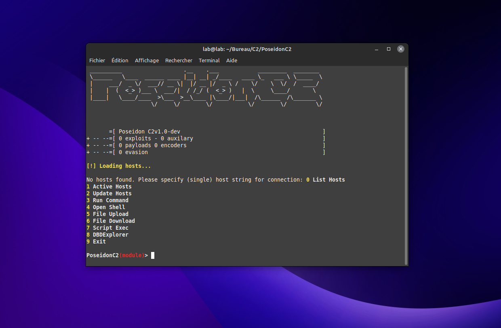

# PoseidonC2

  
  <h1>PoseidonC2</h1>
   

  
<i>Poseidon C2 is a remote management tool for Linux machines, created for penetration testing and security auditing. The tool uses the Python Fabric module to perform remote tasks on the target machines and to obtain system information about these machines.</i>

  

